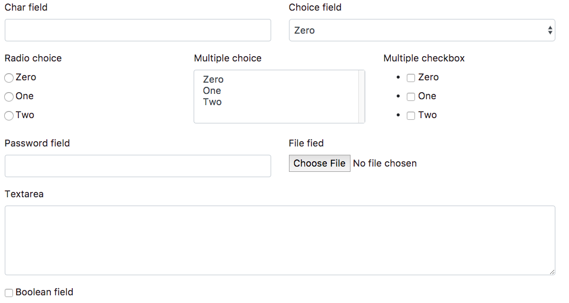

=====================
Django bootstrap form
=====================

.. image:: https://badge.fury.io/py/django-bootstrap-form.png
   :alt: PyPI version
   :target: https://pypi.python.org/pypi/django-bootstrap-form

.. image:: https://travis-ci.org/tzangms/django-bootstrap-form.png?branch=master   
    :target: https://travis-ci.org/tzangms/django-bootstrap-form

.. image:: https://coveralls.io/repos/tzangms/django-bootstrap-form/badge.png?branch=master  
   :target: https://coveralls.io/r/tzangms/django-bootstrap-form?branch=master
   

Twitter Bootstrap for Django Form.

A simple Django template tag to work with `Bootstrap <http://getbootstrap.com/>`_

Installation
======

Install django-bootstrap-form with pip

.. code-block:: sh

    $ pip install django-bootstrap-form

Usage
======

Add "bootstrapform" to your INSTALLED_APPS.

At the top of your template load in our template tags::

	
	
Vertical
~~~~~~~~~~~~~~~~~

Then to render your form::

	<form role="form">
	    <legend>Form Title</legend>
	    
	    {{ form|bootstrap }}
	    

	      <button type="submit" class="btn btn-primary">Submit</button>
	    

	</form>

You can also set class="form-vertical" on the form element.

To use class="form-inline" on the form element, also change the "|boostrap" template tag to "|bootstrap_inline".

Horizontal
~~~~~~~~~~~~~~~~~

It is also possible to create a horizontal form. The form class and template tag are both changed, and you will also need slightly different CSS around the submit button::

	<form class="form-horizontal">
	    <legend>Form Title</legend>
	    
	    {{ form|bootstrap_horizontal }}
	    

	      

	      	<button type="submit" class="btn btn-primary">Submit</button>
	      

	    

	</form>

Custom Layout
~~~~~~~~~~~~~~~~~

For custom layout - use  tag - each line in it represent bootstrap .row with fields separted by space::

	<form class="form-horizontal">
	    <legend>Form Title</legend>
	    
	    
		char_field choice_field 
		radio_choice multiple_choice multiple_checkbox
		password_field file_fied
		textarea
		boolean_field
	    
	    

	      

	      	<button type="submit" class="btn btn-primary">Submit</button>
	      

	    

	</form>

Will result layout like this

Demo
=====

Checkout this `Demo site <http://django-bootstrap-form.herokuapp.com/>`_ to see it in action. 
