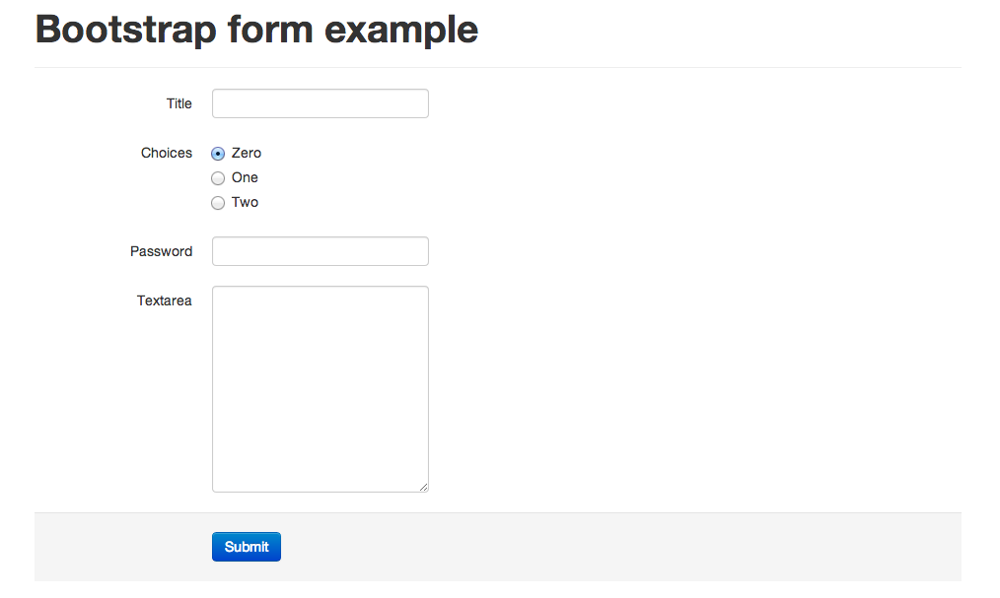

======================
Django semanticui form
======================

Generate `Semantic UI <http://semantic-ui.com/>`_ form output for Django form

Screenshot
-----------

Installation
------------

Install ``django-semanticui-form`` with pip

.. code-block:: sh

    $ pip install django-semanticui-form

Configuration
-------------

Add ``semanticuiform`` to ``INSTALLED_APPS``.

.. code-block:: python

    INSTALLED_APPS = (
        ...
        'semanticuiform',
        ...
    )

Usage
------

.. code-block:: none

    

    {{ form|semanticui }}

    # or use with individual field
    {{ form.<field name>|semanticui }} - To output individual fields

    # For inline forms
    {{ form|semanticui_inline }}
