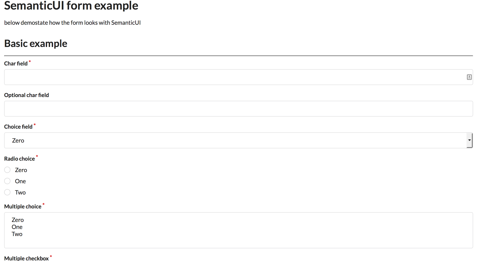

=====================
Django bootstrap form
=====================

Generate twitter-bootstrap form output for django form

A simple Django template tag to work with twitter bootstrap ( http://twitter.github.com/bootstrap/ )

Screenshot
-----------

Installation
------------

Install django-bootstrap-form with pip

.. code-block:: sh

    $ pip install django-bootstrap-form

Configuration
-------------

Add 'bootstrapform' to INSTALLED_APPS.

.. code-block:: python

    INSTALLED_APPS = (
        ...
        'bootstrapform',
        ...
    )

Usage
------

.. code-block:: none

    

    {{ form|bootstrap }}

    # Optionally set the nº of columns
    {{ form|bootstrap:"3" }}

    # Or use with individual field
    {{ form.<field name>|bootstrap }} - To output individual fields

    # For horizontal forms
    {{ form|bootstrap_horizontal }}

    # Or with custom size (default is 'col-lg-2 col-sm-2')
    {{ form|bootstrap_horizontal:'col-lg-4' }}

CHANGELOG
---------

- 2017-3-13:

  Add support to set the nº of columns

- 2013-8-27:

  Add support for Bootstrap 3, contributed by `Nivl <https://github.com/Nivl>`_

- 2013-5-7:

  Add `radio` support for ChoiceField
